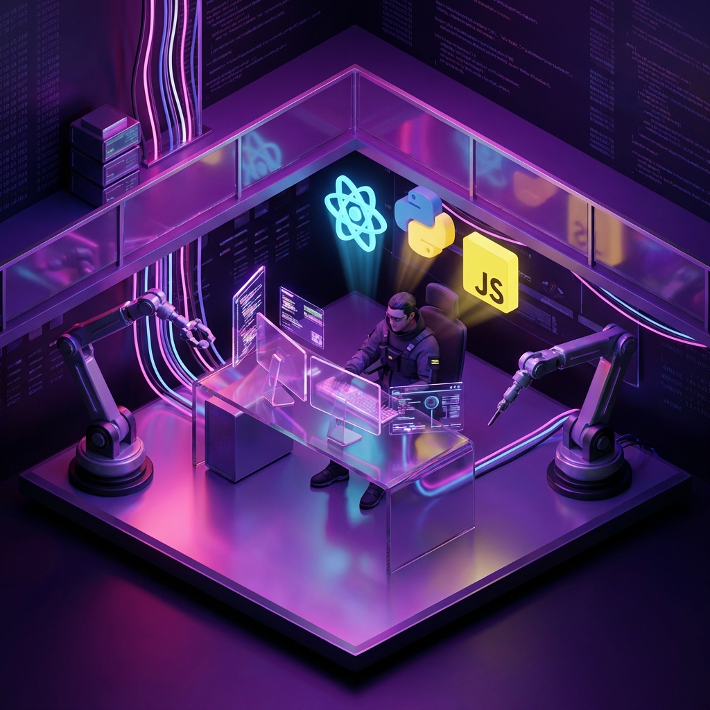

<!-- ╔═══════════════════════════════════════════════════════════════════════════════════════╗ -->
<!-- ║                          ✨ REDA BOUIZERGANE — DEVELOPER PORTFOLIO ✨                  ║ -->
<!-- ╚═══════════════════════════════════════════════════════════════════════════════════════╝ -->

<!-- 🎨 PREMIUM 3D ANIMATED HEADER -->

<!-- ⌨️ TERMINAL TYPING EFFECT -->
 

  

 

<!-- 🏷️ PROFILE QUICK-LINKS & METRICS -->

  
  
  
  

 

<!-- ═══════════════════════════════════════════════════════════════════════════════════════ -->
<!-- ░░░░░░░░░░░░░░░░░░░░░░░░░░░░░░░░ ABOUT ME (3D) ░░░░░░░░░░░░░░░░░░░░░░░░░░░░░░░░░░░░░░░░░░░ -->
<!-- ═══════════════════════════════════════════════════════════════════════════════════════ -->

  

<table border="0" cellpadding="10" cellspacing="0" align="center">
  <tr>
    <td width="60%" valign="top">
      <h2>
        
        Salut, Je suis Reda!
      </h2>
      

        I'm a <b>Full-Stack Developer</b> specializing in high-performance, visually stunning digital experiences. I thrive on the synergy between <b>premium design</b> and <b>robust logic</b>.
      

      

        
        
      

    </td>
    <td width="40%" align="center" valign="middle">
      <!-- 🎥 CUSTOM 3D ISOMETRIC RENDER -->
      
    </td>
  </tr>
</table>

 

  

<!-- 3D FLOATING CARDS SECTION -->

  
  
  

 

  
<b>📂 Core Insights & Language Ecosystem</b>

   
  

    
    
  

 

<!-- ═══════════════════════════════════════════════════════════════════════════════════════ -->
<!-- ░░░░░░░░░░░░░░░░░░░░░░░░░░░░░░░ TECH STACK ░░░░░░░░░░░░░░░░░░░░░░░░░░░░░░░░░░░░░░░░░░░░ -->
<!-- ═══════════════════════════════════════════════════════════════════════════════════════ -->

<h2>
  
  Technical Arsenal
</h2>

 

<!-- 3D ANIMATED SKILL ICONS - COMPACT GRID -->

  
    
  
    
  
    
  

 

<!-- METHODOLOGIES BADGES -->

  
  
  
  
  

<!-- ═══════════════════════════════════════════════════════════════════════════════════════ -->
<!-- ░░░░░░░░░░░░░░░░░░░░░░░░░░░░░░░ 42 SCHOOL ░░░░░░░░░░░░░░░░░░░░░░░░░░░░░░░░░░░░░░░░░░░░░ -->
<!-- ═══════════════════════════════════════════════════════════════════════════════════════ -->

<h2>
  
  42 Network Academy
</h2>

  

<!-- ═══════════════════════════════════════════════════════════════════════════════════════ -->
<!-- ░░░░░░░░░░░░░░░░░░░░░░░░░░░░ GITHUB ANALYTICS ░░░░░░░░░░░░░░░░░░░░░░░░░░░░░░░░░░░░░░░░░ -->
<!-- ═══════════════════════════════════════════════════════════════════════════════════════ -->

<h2>
  
  Performance Metrics
</h2>

 

  

  
  
  

  

<!-- ═══════════════════════════════════════════════════════════════════════════════════════ -->
<!-- ░░░░░░░░░░░░░░░░░░░░░░░░░░░░ 3D CONTRIBUTIONS ░░░░░░░░░░░░░░░░░░░░░░░░░░░░░░░░░░░░░░░░░ -->
<!-- ═══════════════════════════════════════════════════════════════════════════════════════ -->

  <h2>
    
    Contribution Game
  </h2>
  
  
    
  
  <h2>
    
    3D Activity Map
  </h2>
  
  
  

    
  

<!-- ═══════════════════════════════════════════════════════════════════════════════════════ -->
<!-- ░░░░░░░░░░░░░░░░░░░░░░░░░░░░░░░ CONNECT ░░░░░░░░░░░░░░░░░░░░░░░░░░░░░░░░░░░░░░░░░░░░░░░ -->
<!-- ═══════════════════════════════════════════════════════════════════════════════════════ -->

<h2>
  
  Get In Touch
</h2>

  
  
  
  
  

  

<!-- ═══════════════════════════════════════════════════════════════════════════════════════ -->
<!-- ░░░░░░░░░░░░░░░░░░░░░░░░░░░░░░░░ QUOTE ░░░░░░░░░░░░░░░░░░░░░░░░░░░░░░░░░░░░░░░░░░░░░░░░ -->
<!-- ═══════════════════════════════════════════════════════════════════════════════════════ -->

<h2 align="center">
  
  Daily Inspiration
</h2>

  

<!-- 🎨 3D ANIMATED FOOTER -->
 

  

  

  <b>Meticulously Crafted by Reda Bouizergane</b> 
  

