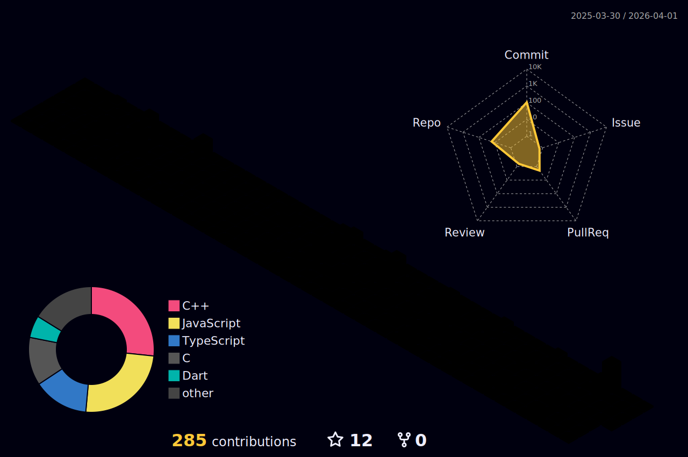

<!-- ╔══════════════════════════════════════════════════════════════════════════╗ -->
<!-- ║                    🚀 REDA BOUIZERGANE — DEVELOPER PROFILE                ║ -->
<!-- ╚══════════════════════════════════════════════════════════════════════════╝ -->

<!-- ═══════════════════════ ANIMATED HEADER ═══════════════════════ -->


<!-- ANIMATED TYPING INTRO -->
<p align="center">
  <a href="https://github.com/Redabouizer">
    
  </a>
</p>

<!-- PROFILE BADGES -->
<p align="center">
  <a href="https://github.com/Redabouizer?tab=followers">
    
  </a>
  <a href="https://github.com/Redabouizer?tab=repositories&sort=stargazers">
    
  </a>
  
</p>

<!-- ═══════════════════ GRADIENT LINE DIVIDER ═══════════════════ -->


<!-- ═══════════════════════ ABOUT ME ═══════════════════════════ -->

<h2>
   
  About Me
</h2>


```javascript
const reda = {
    pronouns: "He" | "Him",
    location: "Morocco 🇲🇦",
    education: [
        "1337 Khouribga (42 Network)",
        "EMSI Casablanca (Honoris)"
    ],
    currentFocus: "Full-Stack Development",
    askMeAbout: [
        "React", "Node.js", "Python", 
        "C/C++", "System Design"
    ],
    technologies: {
        frontEnd: ["React", "Redux", "Next.js", "Tailwind"],
        backEnd: ["Node.js", "Express", "Django", "Laravel"],
        databases: ["PostgreSQL", "MongoDB", "Redis"],
        devOps: ["Docker", "Git", "Linux", "Nginx"]
    },
    funFact: "I debug with console.log() 🐛"
};
```

<br clear="right"/>

<!-- ═══════════════════ ANIMATED LINE DIVIDER ═══════════════════ -->


<!-- ═══════════════════ TECH STACK ═══════════════════════════════ -->

<h2>
  
  Tech Stack
</h2>

<details open>
<summary><b>💻 Languages</b></summary>
<br>
<p align="left">
  
  
  
  
  
  
  
</p>
</details>

<details open>
<summary><b>🎨 Frontend</b></summary>
<br>
<p align="left">
  
  
  
  
  
  
  
</p>
</details>

<details open>
<summary><b>⚙️ Backend & Database</b></summary>
<br>
<p align="left">
  
  
  
  
  
  
  
</p>
</details>

<details open>
<summary><b>🔧 DevOps & Tools</b></summary>
<br>
<p align="left">
  
  
  
  
  
  
</p>
</details>

<br>

<!-- ANIMATED SKILL ICONS -->
<p align="center">
  
</p>

<h4 align="center">📋 Methodologies</h4>
<p align="center">
  
  
  
  
  
  
  
</p>

<!-- ═══════════════════ SOLAR SYSTEM LINE ═══════════════════ -->


<!-- ═══════════════════ 42 SCHOOL ═══════════════════════════════ -->

<h2>
  
  42 School Journey
</h2>

<p align="center">
  <a href="https://github.com/Redabouizer">
    
  </a>
</p>

<!-- ═══════════════════ FIRE LINE DIVIDER ═══════════════════ -->


<!-- ═══════════════════ GITHUB STATISTICS ═══════════════════════ -->

<h2>
  
  GitHub Statistics
</h2>

<!-- STATS + STREAK -->
<p align="center">
  <a href="https://github.com/Redabouizer">
    
  </a>
  <a href="https://github.com/Redabouizer">
    
  </a>
</p>

<!-- TOP LANGUAGES -->
<p align="center">
  <a href="https://github.com/Redabouizer">
    
  </a>
</p>

<!-- TROPHIES -->
<p align="center">
  <a href="https://github.com/ryo-ma/github-profile-trophy">
    
  </a>
</p>

<!-- CONTRIBUTION GRAPH -->
<p align="center">
  <a href="https://github.com/Redabouizer">
    
  </a>
</p>

<!-- PROFILE SUMMARY CARDS -->
<p align="center">
  
</p>

<!-- ═══════════════════ SNAKE ANIMATION ═══════════════════ -->


<h2 align="center">🐍 Contribution Snake</h2>

<p align="center">
  
</p>

<!-- ═══════════════════ 3D CONTRIBUTION ═══════════════════ -->

<h2 align="center">📊 3D Contribution Calendar</h2>

<p align="center">
  
</p>

<p align="center">
  <a href="https://skyline.github.com/Redabouizer/2024" target="_blank">
    
  </a>
</p>

<!-- ═══════════════════ METRICS ═══════════════════ -->


<!-- ═══════════════════ SPOTIFY / CODING MUSIC ═══════════════════ -->

<h2>
  
  🎧 Music
</h2>

<p align="center">
  <a href="https://open.spotify.com/user/31hud3yeez53iqxuq2jm2usy2vfu" target="_blank">
    
  </a>
</p>

<!-- ═══════════════════ LET'S CONNECT ═══════════════════════════ -->


<h2>
  
  Let's Connect
</h2>

<p align="center">
  <a href="https://www.linkedin.com/in/reda-bouizergane" target="_blank">
    
  </a>
  <a href="https://github.com/Redabouizer" target="_blank">
    
  </a>
  <a href="https://gitlab.com/Redabouizer" target="_blank">
    
  </a>
  <a href="mailto:redabouizergane6@gmail.com" target="_blank">
    
  </a>
</p>

<br>

<p align="center">
  
</p>

<!-- ═══════════════════ QUOTE ═══════════════════════════ -->


<h2 align="center">💭 Random Dev Quote</h2>

<p align="center">
  
</p>

<!-- ═══════════════════ FOOTER ═══════════════════════════ -->

<br>

<p align="center">
  
</p>

<p align="center">
  
</p>

<p align="center">
  
</p>

<!-- ANIMATED FOOTER WAVE -->

